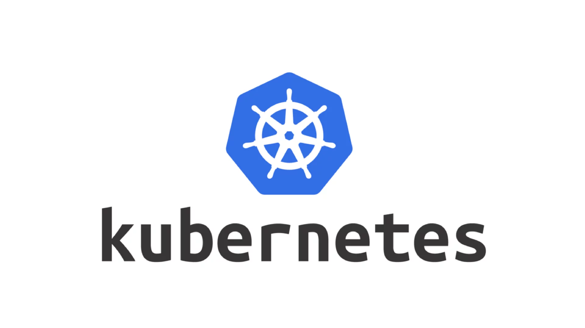

Currently, I'm focusing on learning Kubernetes. I first experimented with Docker on CentOS when I was using ClearOS. Since then, I’ve been fascinated by container technology.

A homelab is a great place to build, break, and fix things and to keep learning.
 

[Install Kubernetes bare metal](install_kubernetes.md)

[Configure cluster networking](configure_cluster_networking.md)

[Install kubectl on management machine](install_kubectl_on_management_machine.md)

[Configure Kubernetes Access on macOS](configure_k8s_access.md)

[Install Argo CD](install_argo_cd.md)

[Reset cluster](reset_cluster.md)

[Cheat sheet](cheat_sheet.md)

[Tips & Tricks](tips_tricks.md)
